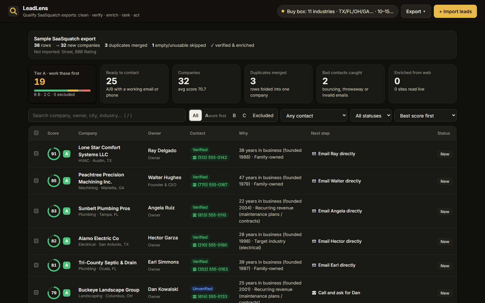
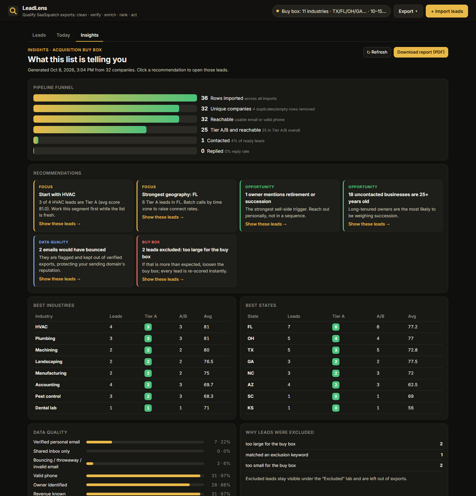
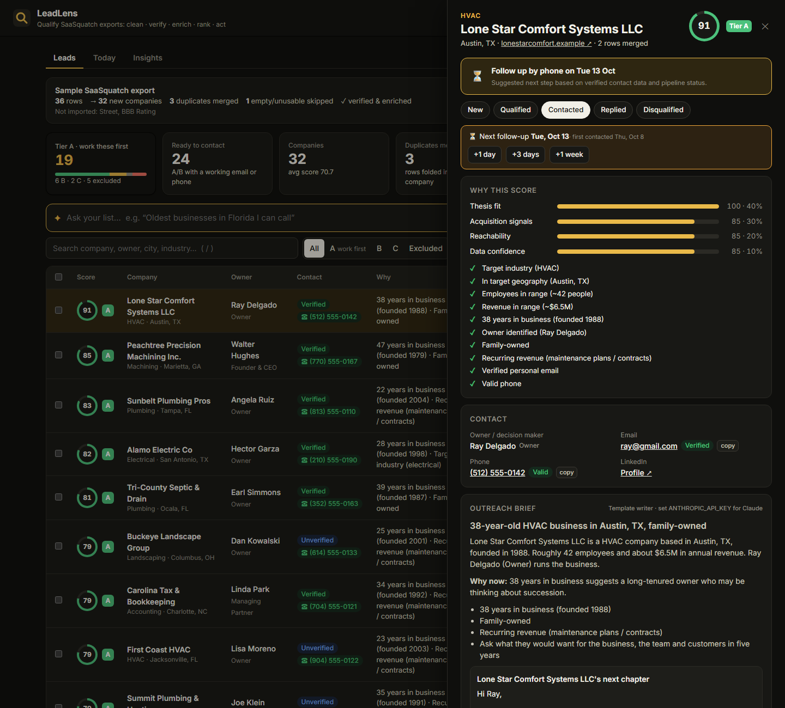
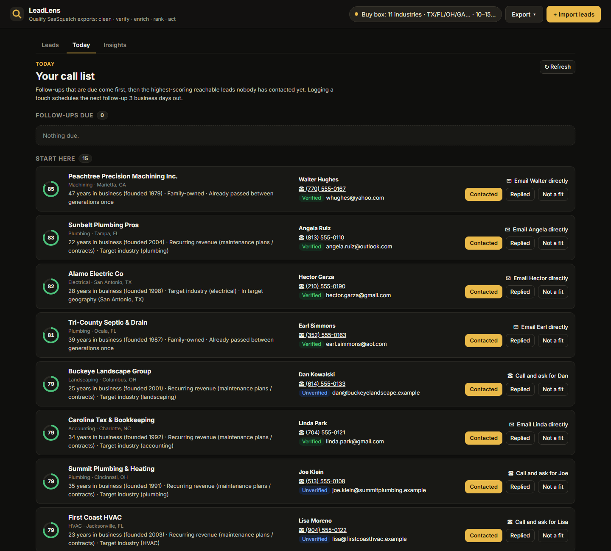
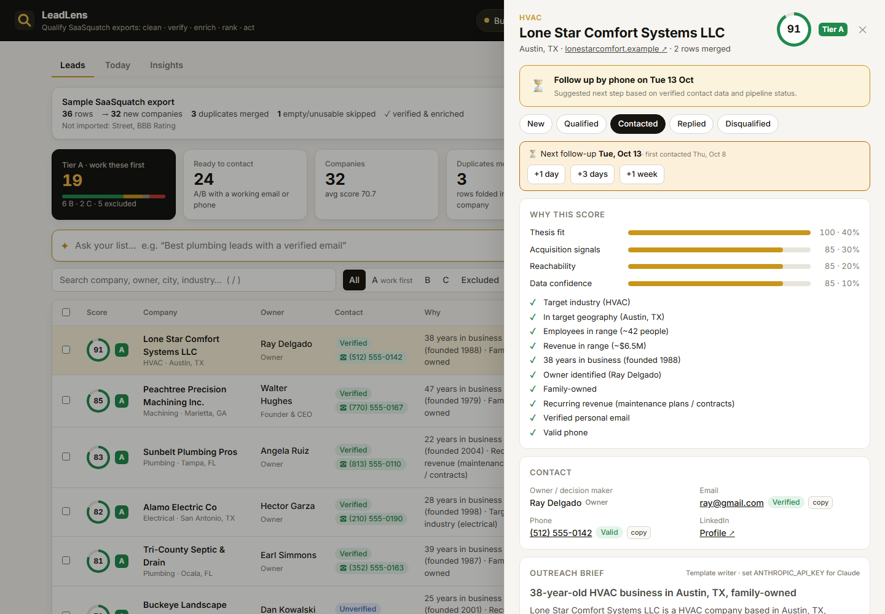
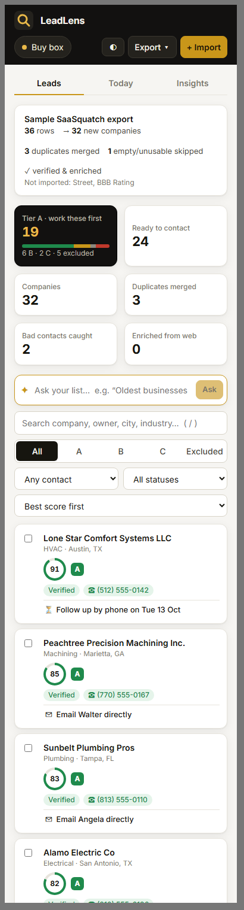
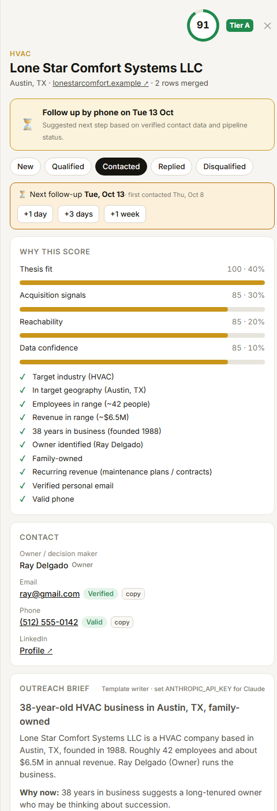
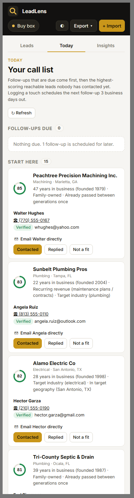

# LeadLens: from a raw SaaSquatch export to a ranked, verified call list

SaaSquatch finds companies. LeadLens tells you **which ones to call first, why, how to reach them, and what to say**.

Upload a lead export (or paste a list of websites). In a few seconds LeadLens:

1. **Cleans**: maps any column layout automatically, merges duplicate rows into one company, and reports empty rows and columns it couldn't use.
2. **Verifies**: grades every email (syntax, disposable, shared inbox, live MX record) and phone (Google's numbering-plan data), so bounces never reach your sequencer.
3. **Enriches**: reads each company's own public website (respecting robots.txt) for missing contacts, founding year, owner name and **acquisition/buying signals**, each with the sentence it came from.
4. **Ranks**: scores every lead 0–100 against *your* buy box or ideal customer profile, assigns a tier (A work first · B · C · X excluded with a stated reason), and shows every reason behind the number.
5. **Acts**: suggests the next step per lead, writes a one-screen outreach brief and first email (Claude, with a template fallback), tracks pipeline status and notes, and exports to **HubSpot** or **Salesforce** import format.

On top of the ranked list:

| | Feature | What it does |
|---|---|---|
| ✦ | **Ask your list** | Type *"family-owned HVAC in Texas over 20 years, not contacted"*. Claude (or an offline rule parser) turns it into exact, removable filters. The model only writes filters and never sees or invents lead data. |
| ⏳ | **Today's call list** | Due follow-ups first, then the best reachable leads nobody has touched. Logging a touch schedules the next follow-up 3 business days out (skipping weekends), with one-click snooze. |
| 📊 | **Insights report** | Funnel (rows → companies → reachable → A/B → contacted → replied), best industries and states, data-quality profile, exclusion reasons, and plain-English recommendations that open the matching leads. Prints to PDF. |
| 🔗 | **CRM webhook** | Push the current view as JSON batches to Zapier / Make / n8n / a HubSpot workflow; SSRF-guarded like the crawler. |






| Light theme | Phone: leads | Phone: lead detail | Phone: call list |
|---|---|---|---|
|  |  |  |  |

**Submission extras:** [2-minute video script](docs/VIDEO_SCRIPT.md) · [API walkthrough (`.http`)](docs/api-demo.http) ·
[Business Understanding answers](docs/BUSINESS_UNDERSTANDING.md)

---

## Why this feature

Caprae buys and grows small businesses (ETA / search fund / PE), and SaaSquatch is its sourcing engine. A scrape is
only the start: a 2,000-row export is full of duplicates, bouncing emails, franchises, companies 10× too big and
closed businesses, and it says nothing about **which owner might want to sell**. Reps then spend hours in
spreadsheets before the first call, and bounces damage the sending domain.

LeadLens is the step between "scraped" and "contacted":

| Pain in a raw export | What LeadLens does |
|---|---|
| Same company on 3 rows with different spellings | Dedup by domain, else by normalized name + state; merges fill blanks only |
| Many emails bounce and hurt the sending domain | MX-verified, disposable and shared-inbox addresses flagged before export |
| No way to tell a 40-year family business from a franchise | Acquisition signals: years in business, family/owner-operated, multi-generation, recurring revenue (maintenance plans), retirement/succession mentions, under-invested website |
| "Why is this lead hot?" | Transparent score: 4 weighted components plus a plain-English reason list |
| Copy-paste into the CRM | HubSpot / Salesforce CSVs with native column names plus score, tier, reasons and next action |
| Blank-page outreach | Brief + first email grounded only in verified facts |

**Two modes, one engine.** The *Acquisition* thesis (the default, aligned with Caprae's buy-and-build model) rewards
business age, owner-operated businesses, recurring revenue and succession signals. The *Sales* profile (for
SaaSquatch's sales-team users) weights reachability, named decision makers and hiring. Changing the thesis re-scores
every lead instantly, because scoring is a pure function.

### How the score works

| Component | Acquisition weight | Sales weight | What it measures |
|---|---|---|---|
| Thesis fit | 40% | 40% | Industry, geography, employee band, revenue band |
| Signals | 30% | 15% | Years in business, owner identified, family/owner-operated, recurring revenue, retirement, stale website (value-creation lever) / hiring, multi-location |
| Reachability | 20% | 35% | Verified personal email > shared inbox; valid phone; LinkedIn; live website |
| Data confidence | 10% | 10% | Completeness, corroboration across merged rows, live site |

Unknown values earn partial credit (missing is not a mismatch). Tier A ≥ 70, B ≥ 50. **Tier X** is for clear
disqualifiers, with the reason shown: excluded keyword (e.g. *franchise*), 3× outside the size or revenue band, or no
working way to reach anyone. Excluded leads stay visible, but are left out of exports by default.

### Ethical data collection

* Reads only public company homepages plus at most 2 about/contact pages, with a 400 ms pause between pages.
* Identifies itself (`LeadLensBot/1.0 (+repo URL)`) and **obeys robots.txt** (RFC 9309: longest match, 5xx = stay out).
* **Never bypasses CAPTCHAs or bot checks.** Cloudflare, reCAPTCHA, hCaptcha and similar challenges are detected,
  recorded as "Bot check: not bypassed", and the lead keeps its imported data.
* **Rate limits and IP restrictions are respected, not evaded:** on HTTP 429/503 the crawler honours `Retry-After`
  once (up to 10 s), otherwise it records "rate limited" and moves on. No proxy rotation, no spoofed browsers.
* No SMTP mailbox probing (it is abusive and gets IPs blocklisted). Email checks use DNS only.
* SSRF-safe: every URL and every redirect hop must resolve to a public IP on port 80/443.
* CSV exports neutralise spreadsheet formula injection (`=`, `+`, `-`, `@`).

### UX design choices

* **One question per screen.** *Leads* answers "who is worth it?", *Today* answers "who do I call now?",
  *Insights* answers "where should we focus?". Each is one tab, never a settings maze.
* **Explain every number.** Scores are never shown without reasons: a ring + tier in the table, the top two
  distinctive reasons in the "Why" column, and the full component breakdown in the lead drawer. Reps trust what
  they can check, and reviewers can audit the model.
* **Always say what to do next.** Every lead carries a next action ("Email Ray directly", "Call and ask for Dan",
  "Follow up by phone on Tue 13 Oct"), so the list can be worked top to bottom without thinking.
* **Show provenance.** Fields found on the website carry a `web` tag, signals quote the sentence they came from, and
  email badges say *why* ("Bounces: no mail servers").
* **Progress, not spinners.** Imports show cleaned rows within a second and a live progress bar while verification
  and enrichment stream in; nothing blocks the UI.
* **Keyboard and speed:** `/` focuses search, `j`/`k` move through leads, `Esc` closes panels, and
  `?lead=<id>` links reopen a lead.
* **Visual system:** a single gold accent on near-black (the Caprae palette) for primary actions; green, amber, grey
  and red reserved for tiers A, B, C and X; Inter for legibility in dense tables.
* **Light, dark or system theme** (◐ / ☀ / ☾ in the top bar), remembered per browser and applied before first paint.
* **Responsive:** on phones the table becomes cards (score, contact, next step), filters stack, the drawer goes
  full-screen, and the Today list keeps one-tap *Contacted* / *Replied* buttons. On tablets low-priority columns hide.
  It prints cleanly: *Insights → Download report* produces a PDF.
* **Accessible by default:** semantic buttons and labels, `aria-live` toasts, focus outlines, colour never the only
  signal (tiers also carry a letter).

### How this maps to the evaluation criteria

| Criterion | Where it shows up |
|---|---|
| **Business use case** (10) | Acquisition buy box aligned with Caprae's ETA thesis; tiers prioritise high-impact leads; Tier X removes irrelevant ones with a reason; HubSpot / Salesforce / webhook export into existing workflows; Insights turn the list into strategy |
| **UX/UI** (10) | Guided import → verify → filter → act; plain-English *Ask*; *Today* call list with follow-up automation; next action per lead; keyboard shortcuts; responsive |
| **Technicality** (10) | Two sources (CSV of any layout + live websites); dedup, enrichment, validation (MX, disposable, role, phone); polite crawler (robots.txt, SSRF guard, bot-check detection, Retry-After); bulk dedup and a 5,000-row benchmark; 33 tests; CI |
| **Design** (5) | Consistent tokens, tier colours, light/dark themes, cards on mobile, printable report |
| **Other** (5) | Claude briefs + natural-language search with safe fallbacks; automated reporting; CRM webhook; ethical collection; full docs, API walkthrough, video script |

---

## Architecture

```
leadlens/
├── frontend/   Angular 22 SPA (TypeScript)       ng build → backend/src/main/resources/static
├── backend/    Spring Boot 3.3 REST API (Java 17) serves /api/** and the built SPA
├── docs/       screenshots, video script
├── Dockerfile  3 stages: Node build → Maven build → JRE runtime (one image)
└── docker-compose.yml, render.yaml, .github/workflows/ci.yml
```

```
Angular 22 SPA (standalone components, signals, zoneless)
   ├─ core/      models.ts (typed API contract) · ApiService (HttpClient) · LeadStore (signal state, polling)
   ├─ features/  topbar · dashboard (KPIs, import report) · leads (filters, table, bulk) ·
   │             lead-detail (drawer, brief) · import (CSV / websites) · thesis (reactive form)
   └─ shared/    score ring · email badge · formatting
   │  REST/JSON, same origin
   ▼
Spring Boot 3.3 (Java 17)
   ├─ ingest/    CsvLeadParser: header aliases + keyword fallback, delimiter sniffing
   ├─ service/   LeadIngestService: normalize → dedup/merge → pre-score → save (one transaction)
   │             LeadProcessor: bounded worker pool → MX verify → crawl → fill blanks → score
   ├─ quality/   Normalizer, EmailVerifier, DnsMailDomainChecker (JNDI DNS, per-type queries, fallback resolvers)
   ├─ enrich/    SafeFetcher (robots, SSRF guard, redirects, size/time caps) · PageExtractor · BotChallenge
   ├─ scoring/   Thesis (buy box) · LeadScorer (pure, explainable)
   ├─ ai/        BriefService (Claude structured output) · TemplateBriefWriter (deterministic fallback)
   └─ export/    CrmExporter (HubSpot / Salesforce / full)
   │  JPA + Flyway
   ▼
PostgreSQL (Neon, serverless) in production · H2 file DB locally
```

| Layer | Choice | Why |
|---|---|---|
| Language / framework | Java 17, Spring Boot 3.3 (Web, Data JPA, Validation, Actuator) | Typed, testable, one deployable |
| Frontend | **Angular 22** (standalone components, signals, zoneless change detection, OnPush), TypeScript, `HttpClient`, reactive forms; hand-written CSS design tokens with light/dark themes; Inter font | Typed end to end against the API models; ~93 kB gzipped; built into the Spring Boot jar so it is served same-origin (no CORS) |
| Database | **PostgreSQL** (Neon serverless in production), H2 in PostgreSQL mode locally | Relational data with filters and sorts; zero-install dev |
| Schema | Flyway migrations (`backend/src/main/resources/db/migration`) | Same schema on H2 and Postgres |
| Parsing | Apache Commons CSV, jsoup, Google libphonenumber | Battle-tested parsers for messy input |
| AI | Anthropic Java SDK, `claude-opus-5-5`, structured outputs (JSON schema from the `Brief` record) | Schema-checked output, no parsing hacks; server-side refusal fallback enabled |
| Caching | Caffeine in-memory: MX results 24 h, robots.txt 6 h, website enrichment 24 h per domain; briefs persisted on the lead | A 2,000-row import touches a few hundred domains, and gmail.com is looked up once |
| Concurrency | Fixed pool (6 workers) + queue; network I/O outside DB transactions; optimistic locking with retry | Polite to target sites, never blocks the UI, safe against concurrent edits |
| Performance | Dedup matches pre-loaded with `IN` queries (500 keys each) instead of 1–2 lookups per row; indexes on domain / company key / tier+score / status / follow-up date; pre-score on import | Measured below; rows appear before enrichment finishes, with a progress bar |
| Hosting (target) | **Render** Docker web service (always-on container, not serverless: the worker pool needs a long-lived process; US region) + **Neon** serverless PostgreSQL (runs on **AWS**, us-east-1). The SPA is static files served by the same container | Simple, cheap, git-push deploys; one origin, no CORS |
| Deployment | GitHub Actions (Angular build, `mvn verify`, Docker build) → Render auto-deploys `main` from the `Dockerfile` (`render.yaml` blueprint) | Every deploy is tested |
| Scale-up path | Serve `frontend/` from a CDN (Vercel / S3 + CloudFront) and the API separately | Only needed when traffic justifies two deploys |

---

## Run it

**Prerequisites:** JDK 17+, Maven 3.8+ and Node.js 22+ (or just Docker).

**Option A: one server (what production runs)**

```bash
cd frontend && npm ci && npx ng build      # writes the SPA into backend/src/main/resources/static
cd ../backend && mvn spring-boot:run       # http://localhost:8080  (H2 database in backend/data)
```

**Option B: frontend development with live reload**

```bash
cd backend && PORT=8090 mvn spring-boot:run   # API on 8090
cd frontend && npm ci && npx ng serve         # http://localhost:4200, /api proxied to 8090 (proxy.conf.json)
```

Click **Try the sample** to load `backend/src/main/resources/sample/saasquatch-export-sample.csv`: 36 synthetic rows with
duplicates, a broken email, throwaway addresses, a franchise, oversized companies and an empty row. The sample uses
reserved `.example` domains, so no real business is crawled. To see live website enrichment, use **Import → Paste
websites** with real domains.

**Claude-written briefs (optional):** `ANTHROPIC_API_KEY=sk-ant-... mvn spring-boot:run` (in `backend/`). Without a key, briefs come
from the built-in template writer using the same verified facts.

**With PostgreSQL (production shape):**

```bash
docker compose up --build      # app + Postgres 16 on http://localhost:8080
```

**Deploy (recommended setup, not live yet):** create a Neon database, then a Render web service from this repo (Docker). Set `SPRING_DATASOURCE_URL`
(`jdbc:postgresql://<host>/<db>?sslmode=require`), `SPRING_DATASOURCE_USERNAME`, `SPRING_DATASOURCE_PASSWORD` and
optionally `ANTHROPIC_API_KEY`. Flyway creates the schema on first boot. The health check is `/actuator/health`.

**Tests:** `cd backend && mvn test` runs 33 tests: parsing, normalization, verification, robots.txt and Retry-After, extraction,
scoring, SSRF and export safety, the plain-English query parser (including sanitising model output), follow-up
scheduling, webhook payloads, an end-to-end import of the sample with insights and the call list, and a scale
benchmark. All run offline (DNS mocked, crawler off).

**Measured at scale** (`ScaleBenchmarkTest`, 5,000-row export with 1,000 duplicates, H2, laptop):

| Step | Before tuning | After |
|---|---|---|
| Parse, dedup, pre-score and save 4,000 companies | 12.3 s | **4.5 s** |
| Plus verification and final scoring of every lead | 19.2 s | **13.4 s** |

The fix was loading dedup candidates in bulk (`IN` queries) instead of querying per row. Next lever: sequence-based
IDs so Hibernate can batch the inserts.

### Configuration (`application.yml` or environment)

| Key | Default | Meaning |
|---|---|---|
| `leadlens.pipeline.threads` | 6 | Concurrent verification/enrichment workers |
| `leadlens.crawler.enabled` | true | Turn website enrichment off (offline demos) |
| `leadlens.crawler.extra-pages` / `delay-ms` | 2 / 400 | Pages read after the homepage, and the pause between them |
| `leadlens.dns.fallback-servers` | 1.1.1.1,8.8.8.8 | Used only if the OS resolver is unusable from Java |
| `leadlens.import.max-rows` | 10000 | Rows read per upload |
| `leadlens.ai.model` | claude-opus-5-5 | Model for briefs |

---

## API

| Method | Path | Purpose |
|---|---|---|
| POST | `/api/imports` (multipart `file`) | Import a CSV; returns the import report |
| POST | `/api/imports/websites` `{"text": "a.com\nb.com"}` | Build leads from websites |
| POST | `/api/imports/sample` | Load the bundled sample |
| GET | `/api/imports/latest` | Progress of the latest import |
| GET | `/api/leads?q=&tier=A,B&contact=verified&status=&state=&sort=score,desc&page=0&size=50` | Filtered, sorted page |
| GET / PATCH | `/api/leads/{id}` `{"status": "CONTACTED", "notes": "…"}` | Detail / update |
| POST | `/api/leads/bulk-status` `{"ids": [1,2], "status": "QUALIFIED"}` | Bulk pipeline update |
| POST | `/api/leads/{id}/brief` | Write (or rewrite) the outreach brief |
| POST | `/api/leads/{id}/refresh` | Re-verify and re-crawl one lead |
| GET | `/api/leads/export?format=hubspot\|salesforce\|full&…same filters` | CSV export |
| GET / PUT | `/api/thesis` | Read / save the buy box (re-scores everything) |
| GET | `/api/stats` | Dashboard numbers |
| POST | `/api/leads/ask` `{"question": "…"}` | Plain-English question → filters (`industry`, `minYears`, `signal`, `state`, …) |
| GET | `/api/leads/today?limit=15` | Call list: due follow-ups, then the best untouched leads |
| PATCH | `/api/leads/{id}` `{"snoozeDays": 3}` | Move a follow-up (0 clears it) |
| GET | `/api/insights` | Funnel, segments, data quality, recommendations |
| GET / PUT | `/api/integrations/webhook` `{"url": "https://…"}` | CRM webhook target |
| POST | `/api/integrations/webhook/send?…same filters` | Push the current view as JSON batches |

A runnable walkthrough of every call is in [`docs/api-demo.http`](docs/api-demo.http).

Example:

```bash
curl -F file=@my-export.csv localhost:8080/api/imports
curl "localhost:8080/api/leads?tier=A&contact=verified" | jq '.items[] | {company, score, nextAction}'
curl -o hubspot.csv "localhost:8080/api/leads/export?format=hubspot&tier=A,B"
```

---

## Limits and next steps

* Work queues are in memory: a restart mid-import marks the import as interrupted (leads keep their imported data
  and can be re-checked). Next: a durable queue (Postgres `SKIP LOCKED` or SQS).
* MX lookups prove a domain accepts mail, not that a specific mailbox exists. Next: plug in a verification API
  (ZeroBounce/NeverBounce) behind the existing `MailDomainChecker` interface.
* Single-user workspace. Next: accounts and saved views; CRM sync today is CSV + webhook, next is native
  HubSpot/Salesforce API push with two-way status sync (replies flowing back into the call list).
* Signal detection is keyword-based with evidence. Next: let Claude classify the crawled text for subtler
  signals, using the same evidence format.
